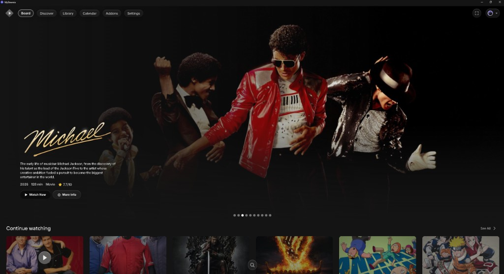
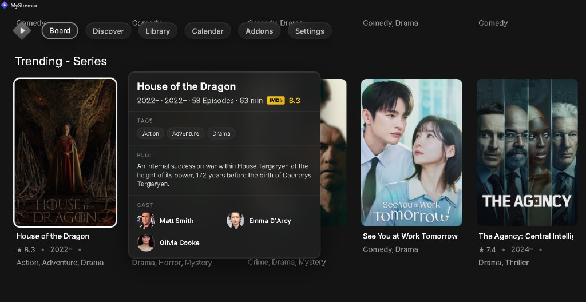
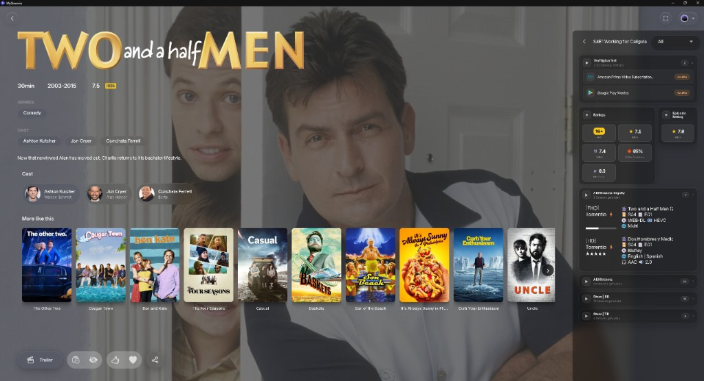
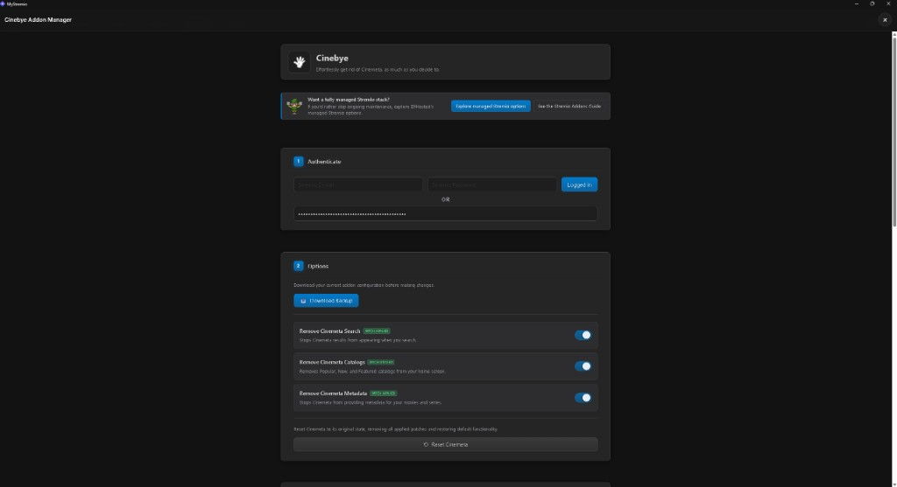
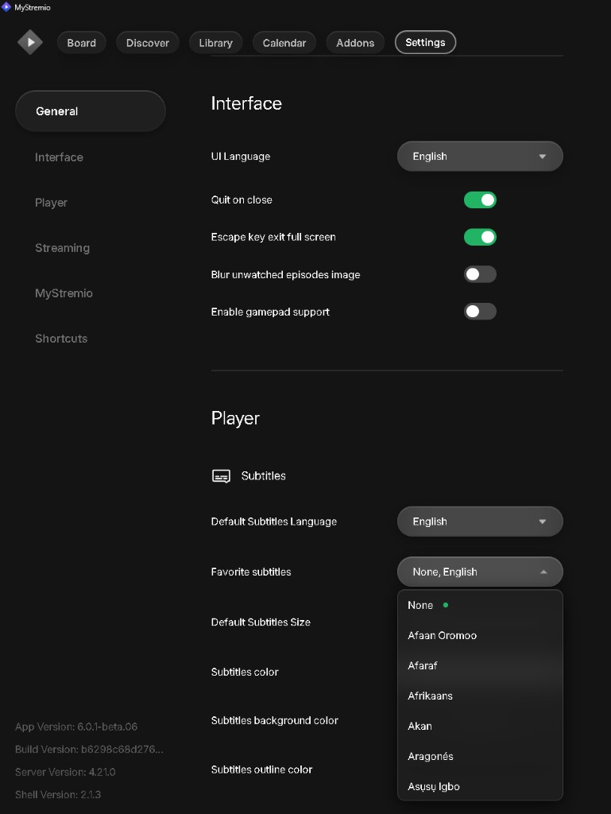
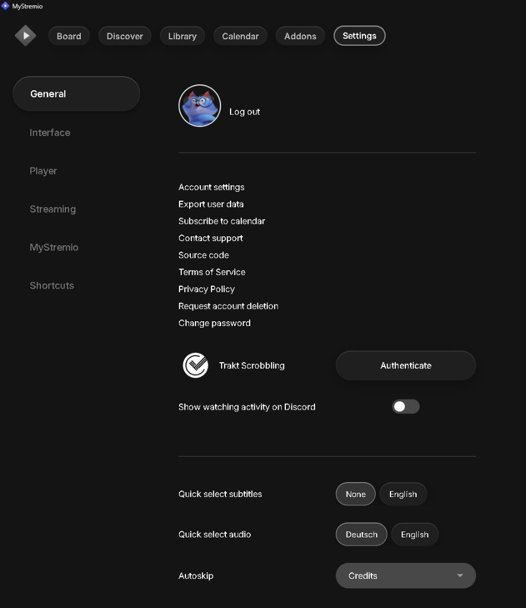
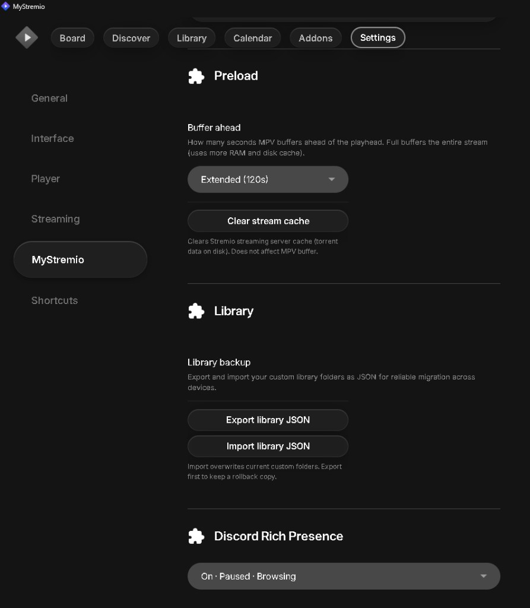

# MyStremio

**MyStremio** is a personalized Windows desktop client built on the Stremio shell stack.
It combines UI upgrades, player improvements, plugins/themes and library tools in one installer.
Current release: **2.2.0**

> **Disclaimer:** MyStremio is an independent community project and is not affiliated with official Stremio.

---

## Features

### Board hero home view

The board includes a native hero section with rotating featured titles.



### Hover metadata in catalogs

While browsing catalogs, hover cards show key information (plot, genres, cast) without forcing a page change.



### Detail view with metadata and stream sidebar

The detail page combines metadata, cast, similar titles, and an extended stream/provider sidebar in one view.



### Cinebye Addon Manager

[Cinebye](https://cinebye.elfhosted.com/) is integrated so you can manage addons inside Stremio and optionally disable specific sources (for example Cinemeta).



### Favorite subtitle and audio languages

Inside player settings, you can define favorite subtitle and audio languages that act as your preferred language pool.
This preference layer is used by the quick language actions shown in the next section.



### Quick Select language shortcuts

Quick Select reads your favorites and exposes them as one-click subtitle/audio buttons, so switching language is fast and consistent during playback.
In short: favorites define what is available, Quick Select is the runtime shortcut layer that applies those preferences immediately.



### Settings: themes and plugins

Themes and plugins can be managed directly from settings, including quick access to the themes/plugins folders.


### Settings: preload, library backup, Discord

Inside **Settings → MyStremio**, you get central controls for buffer/preload, library export/import, and Discord Rich Presence.



### TheIntroDB timestamp submission

Contribute segment timestamps to TheIntroDB while watching. Open the contribute panel from the player, mark times, pick the segment type, and submit — helps improve skip data for everyone.

<!-- Screenshot: tidb-contribute -->

### Seek buttons

Configurable skip-back and skip-forward controls in the player bar — useful for quick rewinds or jumping ahead without scrubbing.


---

## Patch notes

### 2.2.0

- **Board hero banner (native React)** — Featured titles are rendered directly in the board route. This required shipping a **bundled local Web UI** instead of the public Stremio website, and moving **Settings → MyStremio** into native React (autoskip, favorite languages, plugin toggles, Discord, API keys) for a stable settings experience without DOM injection.
- **Stream buffering and player loading** — Reworked playback startup and buffering: configurable preload, a cleaner loading state that keeps title artwork visible, and a more stable hand-off when a stream starts loading.
- **TheIntroDB timestamp submission** — Submit intro, outro, recap, and preview timestamps to [TheIntroDB](https://theintrodb.org/) from the player (mark start/end, pick segment type, submit with your API key).
- **Seek buttons** — Skip backward and forward from the player control bar with a configurable interval (Settings → MyStremio → Plugins).
- **Plugin and player adjustments** — Updates to stream UI, TheIntroDB skip logic, continue-watching covers, metadata hover panels, and data enrichment mount targeting.
- **Player shell assets** — Updated player loading overlay, glass-style controls, playback API integration, and seek-buffer handling.
- **Custom board scrollbar** — Always-visible scrollbar on the board and other main catalog views, alongside mouse-wheel scrolling.
- **Scroll behavior in panels and menus** — Metadata hover panels and library context menus close when you scroll.
- **Navigation during tab switches** — The horizontal navigation bar stays in place while routes load, without jumping or briefly disappearing.

---

## Installation

1. Download the latest installer from this repository's **Releases** page.
2. Run `MyStremioSetup-v2.2.0_x64.exe` (or the latest version).
3. The installer sets up:
   - App binaries (`mystremio-shell.exe`, streaming server, FFmpeg, libmpv)
   - Bundled plugins and themes
   - Prebuilt local Web UI
   - WebView2 runtime (if missing)
   - Protocol handlers (`stremio://`, `magnet:`, optional `.torrent`)
4. Launch MyStremio from the Start menu or desktop shortcut.

### Install paths

- App: `%LOCALAPPDATA%\Programs\MyStremio\`
- User data (settings/addons): `%APPDATA%\MyStremio\`

### Requirements

- Windows 10/11 (64-bit)
- Internet connection (addons, metadata sources, streaming)
- Optional API keys for plugins (for example TMDB, TheIntroDB)

### Uninstall

Use **Windows Apps & Features** or the Start menu uninstaller.
Optionally delete `%APPDATA%\MyStremio\` to remove all local user data.

---

## First-time setup

1. Install and launch MyStremio.
2. Sign in with your Stremio account.
3. Open **Settings → MyStremio** and configure optional items:
   - Preload/buffer
   - Themes/plugins
   - Discord Rich Presence
   - Plugin API keys (TheIntroDB for timestamp submission)
4. Create library folders and use JSON import/export when needed.

---

## Themes and plugins (manual files)

1. Open **Settings → MyStremio**.
2. Click **Open themes/plugins folder**.
3. Place your theme/plugin files in that folder.
4. Toggle the switch and press CTRL+R to reload the app.

---

## Build from source (developers)

Requires Rust (MSVC), Visual Studio Build Tools, Inno Setup 6, Node.js with pnpm (optional, for Web UI rebuild), and an installed Stremio Desktop runtime (for `libmpv-2.dll`).

```powershell
cd stremio-shell\stremio-shell-ng-main
.\package-release.ps1
```

Output: `release\MyStremioSetup-v2.2.0_x64.exe`

The repo includes a prebuilt `stremio-shell/stremio-shell-ng-main/webui/` bundle. To rebuild the Web UI from source, clone [stremio-web](https://github.com/Stremio/stremio-web) into `.tmp/stremio-web`, apply MyStremio patches, then run the build script again.

---

## Privacy and local data

- No API keys or personal settings are prefilled in the installer.
- Settings, addon data, and library structure are stored locally in `%APPDATA%\MyStremio\`.
- Cinebye login uses your Stremio session at runtime — no credentials are stored in the repository.
- Discord Rich Presence only sends data when enabled and connected.

---

## Credits

MyStremio is based on the following independent community projects:

- [REVENGE977/stremio-enhanced](https://github.com/REVENGE977/stremio-enhanced)
- [Fxy6969/Stremio-Glass-Theme](https://github.com/Fxy6969/Stremio-Glass-Theme)
- [Bo0ii/StreamGo](https://github.com/Bo0ii/StreamGo)
- [TheIntroDB](https://theintrodb.org/)

These projects were important inspiration, and I used many of their features for my own custom build.

---

## Feedback

This started as a fun personal project and is improved iteratively.
If you find reproducible bugs or have ideas, please share feedback or open an issue.
