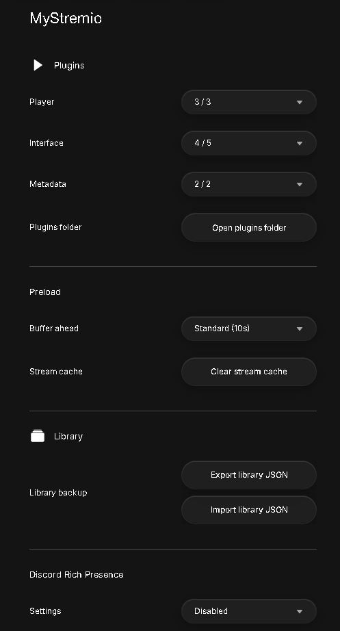
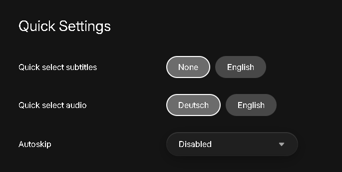
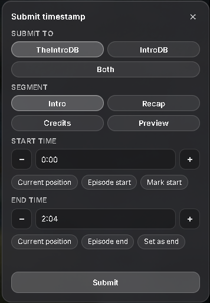

# MyStremio

**MyStremio** is a personalized Windows desktop client built on the Stremio shell stack.
It combines UI upgrades, player improvements, plugins/themes and library tools in one installer.
Current release: **2.3.0**

> **Disclaimer:** MyStremio is an independent community project and is not affiliated with official Stremio.

---

## 📌 Table of Contents

- [📌 Table of Contents](#-table-of-contents)
- [❤️ Support](#-support)
- [🚀 Features](#-features)
  - [🪄 UI](#-ui)
  - [⚙️ Settings](#-settings)
  - [📺 Player](#-player)
  - [🎞️ Addon Manager](#-addon-manager)
- [🛠️ Patch Notes](#-patch-notes)
- [💾 Installation](#-installation)
  - [📂 Install paths](#-install-paths)
  - [📋 Requirements](#-requirements)
  - [🗑️ Uninstall](#️-uninstall)
  - [🎬 First-time setup](#-first-time-setup)
- [🎨 Themes and plugins (manual files)](#-themes-and-plugins-manual-files)
- [🧑‍💻 Build from source (developers)](#-build-from-source-developers)
- [🔒 Privacy and local data](#-privacy-and-local-data)
- [🙏 Credits](#-credits)
- [💬 Feedback](#-feedback)

---

### ❓ How MyStremio differs from official Stremio

-MyStremio uses MPV as the native video player

-Improved player tooling (hover timestamp, TheIntroDB/IntroDB with auto-skip options, controllable preload behavior, brightness control)

-Better stream organization and metadata presentation (enrichment panels and cleaner stream UI behavior)

-Integrated Cinebye addon manager (manage addons, disable Cinemeta)

-Custom library groups with JSON import/export

-Additional power-user options such as plugin toggles and Discord Rich Presence

-Packaged as a ready-to-use single installer

---

### ❤️ Support

If you want to support my work you can leave a small tip on [ko-fi](https://ko-fi.com/xalphiijr), I would really appreciate it! <3 

---

## 🚀 Features
### 🪄 UI
MyStremio offers its own UI enhancements and combines it with already existing plugins made by the communtiy.

#### 🏠 Board hero home view

The board includes a hero section with rotating titles. The Theme is made by [Fxy6969/Stremio-Glass-Theme](https://github.com/Fxy6969/Stremio-Glass-Theme) and just slightly optimized by me.

<p align="center">
  
</p>

#### 🖱️ Hover metadata in catalogs

   While browsing catalogs, hover cards show key information (plot, genres, cast) without forcing a page change.

<p align="center">
  
</p>

#### 📖 Detail view with metadata and stream sidebar

The Data Enrichment Plugin by MrBlu03 (if TMDB API-Key is set) offers an enhanced detail page with cast and similar titles.
The StreamUI plugin offers a clean and modern sidebar with folders to pick streams from. (The plugin works for the follwing addons: Most torrent addons, [WatchHub](https://stremio-addons.net/addons/watchhub), [Ratings Aggregator](https://stremio-addons.net/addons/ratings-aggregator), [IMDb Ratings](https://stremio-addons.net/addons/imdb-ratings), [AfterCredits](https://aftercredits.almosteffective.com/configure.html)).

<p align="center">
  
</p>

---

### ⚙️ Settings
MyStremio comes with a few custom settings including Favorite Languages, Plugins and Buffering.

#### 🛠️ MyStremio
In the picture below you can see the MyStremio section in the settings. These include settings for plugins, buffering, library and discord.

<p align="center">
  
</p>

- **Plugins** can be managed directly from settings, including quick access to the plugins folder. There are MyStremio exclusive plugins and communtiy made plugins built into to installer. The following plugins from [REVENGE977's/stremio-enhanced](https://github.com/REVENGE977/stremio-enhanced) are tested and work with MyStremio: Enhanced Title Bar by Fxy, EnhancedCovers by Fxy, SlashtoSearch by REVENGE977. A few of other plugins are slightly tuned to fit into MyStremio including: Dynamic Hero by Fxy, Context Menu Fix by MrBlu03 and Data Enrichment by MrBlu03.

- **Preload** settings determine how much of the video gets bufferd ahead. You can chose from buffering only the next 10 seconds or the entire video. This currently works for torrent/debrid streams and is not designed for usenet or http. That doesn't mean it won't work on those, I just can't test it as I'm not using usenet/http.

- **Library** json can be importet or exportet to keep your custom library entries safe or import them on another device. Updating the app won't remove your library entries, but if you decide to uninstall MyStremio and reinstall it in the future you will need the json to get your custom library back.
  
- **Discord** Rich Presence by [REVENGE977](https://github.com/REVENGE977/) enhances the native Discord integration and shows additional info.

#### ⚡ Quick Select

Quick Select reads your favorites and exposes them as one-click subtitle/audio buttons, so switching language is fast and consistent.
How to define favorites is explained in the section below.

<p align="center">
  
</p> 

#### 🌐 Favorite subtitle and audio languages

Inside **player** settings, you can define favorite subtitle and audio languages that act as your preferred language pool.
This preference layer is used by the quick language actions shown in the previous section.

---

### 📺 Player
MyStremio offers some qualitiy of life changes directly built into the player.

#### ⏱️ TheIntroDB/IntroDB timestamp submission

Contribute segment timestamps to TheIntroDB and/or IntroDB while watching. Open the contribute panel from the player, mark times, pick the segment type, and submit — helps improve skip data for everyone. You have to set your personal API Key in the plugin settings in order to use this feature!

<p align="center">
  
</p>

#### ⏩ Seek buttons plugin

Configurable skip-back and skip-forward controls in the player bar — useful for quick rewinds or jumping ahead without scrubbing. The skip interval can be changed in the settings: MyStremio → Plugins → Player → Seek Buttons.

#### 🔆 Brightness slider

Built in brightness slider to dim the video while watching without the need to change monitor/screen/tv settings.

#### ⏳ Hover Timestamps

Built in timestamps when hovering the seek bar in the player.

---

### 🎞️Addon Manager

[Cinebye](https://cinebye.elfhosted.com/) is integrated so you can manage addons inside Stremio and optionally disable specific sources (for example Cinemeta).

---

### 💡 Planned Features

- **PiP:** I'm working on a picture in picture video mode
- **Seek Bar Thumbnail:** I want to add a thumbnail when hovering over the seek bar in the player.

---

## 🛠️ Patch Notes
### 2.3.0

- **IntroDB integration** — TheIntroDB plugin now loads skip segments from both [TheIntroDB](https://theintrodb.org/) and [IntroDB](https://introdb.app/), with separate API keys, contributor target selection, and a shell-side IntroDB proxy to bypass browser CORS limits.
- **Library title fix** — Library items now show the correct title reliably across navigation and route changes.
- **UI scaling settings** — New **Settings → Interface → UI Scaling** dropdown (75%–200%), independent of Windows display scaling, persisted across restarts via WebView2 zoom.

### 2.2.9

- **Board hero banner (native React)** — Featured titles are rendered directly in the board route. This required shipping a **bundled local Web UI** instead of the public Stremio website, and moving **Settings → MyStremio** into native React (autoskip, favorite languages, plugin toggles, Discord, API keys) for a stable settings experience without DOM injection.
- **Hero loading** — Banner-area loading state instead of a Breaking Bad fallback flash.
- **Settings persistence** — Login, plugins, volume, autoskip, Discord, preload, language, library, and onboarding flags are restored from `%APPDATA%\MyStremio\mystremio-settings.json` before `main.js` loads, so restarts and updates no longer reset user configuration.
- **Stream buffering and player loading** — Reworked playback startup and buffering: configurable preload, and a more stable hand-off when a stream starts loading.
- **TheIntroDB timestamp submission** — Submit intro, outro, recap, and preview timestamps to [TheIntroDB](https://theintrodb.org/) from the player (mark start/end, pick segment type, submit with your API key).
- **Seek buttons** — Skip backward and forward from the player control bar with a configurable interval (Settings → MyStremio → Plugins).
- **In-app updater** — Checks GitHub Releases for `MyStremioSetup-v*_x64.exe`, verifies `SHA256SUMS.txt`, and installs updates via the existing Stremio update banner (still in testing).
- **Player brightness** — Brightness control in the left player bar with MPV tone adjustment, draggable slider, and compact popup UI.
- **Board scroll** — Fixed rubberbanding on the first scroll after app start; scroll position restore only runs when returning from detail/player within the same session.
- **Plugin and player adjustments** — Updates to Stream UI, TheIntroDB skip logic, continue-watching covers, metadata hover panels, and data enrichment mount targeting.
- **Player shell assets** — Updated player loading overlay, glass-style controls, playback API integration, and seek-buffer handling.
- **Custom board scrollbar** — Always-visible scrollbar on the board and other main catalog views, alongside mouse-wheel scrolling.
- **Scroll behavior in panels and menus** — Plugin dropdown menu, metadata hover panels, and library context menus behavior fixed.
- **Navigation during tab switches** — The horizontal navigation bar stays in place while routes load, without jumping or briefly disappearing.
- **Meta Hover Panel** — Removed duplicated year display.
- **Plugin live updates** — Partially added live updates when plugins are toggled.
- **Artifacts** — Fixed artifacts appearing in the subtitle settings and shortcuts section.
- **StreamUI** — Added Usenet grouping to StreamUI plugin (still in testing). Fixed UI language.

---

### Known Issues

- **First stream playback:** On the first stream start after launching the app, the video may remain frozen on the first frame. One click into the seek bar fixes the issue.
- **Cast Search Addon:** The Cast Search Addon is not compatible with the StreamUI plugin as the cast members load the same way as video streams which messes with correct grouping.
- **Formatter:** Flags don't display correctly.
- **Hover timestamps:** When starting a stream from the "Continue Watching" segment on the board, the hover timestamps won't load. Starting the stream from the details page fixes this problem.

---


## 💾 Installation

1. Download the latest installer from this repository's **Releases** page.
2. Run `MyStremioSetup-v2.3.0_x64.exe` (or the latest version).
3. The installer sets up:
  - App binaries (`mystremio-shell.exe`, streaming server, FFmpeg, libmpv)
  - Bundled plugins and themes
  - Prebuilt local Web UI
  - WebView2 runtime (if missing)
  - Protocol handlers (`stremio://`, `magnet:`, optional `.torrent`)
4. Launch MyStremio from the Start menu or desktop shortcut.


### 📂 Install paths

- App: `%LOCALAPPDATA%\Programs\MyStremio\`
- User data (settings/addons): `%APPDATA%\MyStremio\`


### 📋 Requirements

- Windows 10/11 (64-bit)
- Internet connection (addons, metadata sources, streaming)
- Optional API keys for plugins (for example TMDB, TheIntroDB)


### 🗑️ Uninstall

Use **Windows Apps & Features** or the Start menu uninstaller.
Optionally delete `%APPDATA%\MyStremio\` to remove all local user data.

---

## 🧑‍💻 Build from source (developers)

Requires Rust (MSVC), Visual Studio Build Tools, Inno Setup 6, Node.js with pnpm (optional, for Web UI rebuild), and an installed Stremio Desktop runtime (for `libmpv-2.dll`).

```powershell
cd stremio-shell\stremio-shell-ng-main
.\package-release.ps1
```

Output: `release\MyStremioSetup-v2.3.0_x64.exe`

The repo includes a prebuilt `stremio-shell/stremio-shell-ng-main/webui/` bundle. To rebuild the Web UI from source, clone [stremio-web](https://github.com/Stremio/stremio-web) into `.tmp/stremio-web`, apply MyStremio patches, then run the build script again.

---

## 🔒 Privacy and local data

- API keys, personal setting sand library structure are stored locally in `%APPDATA%\MyStremio\`.
- Cinebye login uses your Stremio session at runtime.
- Discord Rich Presence only sends data when enabled and connected.

---

## 🙏 Credits

MyStremio includes parts of the following independent community projects:

- [REVENGE977/stremio-enhanced](https://github.com/REVENGE977/stremio-enhanced)
- [Fxy6969/Stremio-Glass-Theme](https://github.com/Fxy6969/Stremio-Glass-Theme)
- [Bo0ii/StreamGo](https://github.com/Bo0ii/StreamGo)
- [TheIntroDB](https://theintrodb.org/)
- [IntroDB](https://introdb.app/)

These are the projects I used as inspiration and some of their features for my own custom build. Definetly check out TheIntroDB and IntroDB, both of them deliver intro timestamps for us to enjoy for free.

---


## 💬 Feedback

This started as a fun personal project and is improved iteratively.
If you find reproducible bugs or have ideas, please share feedback or open an issue.
