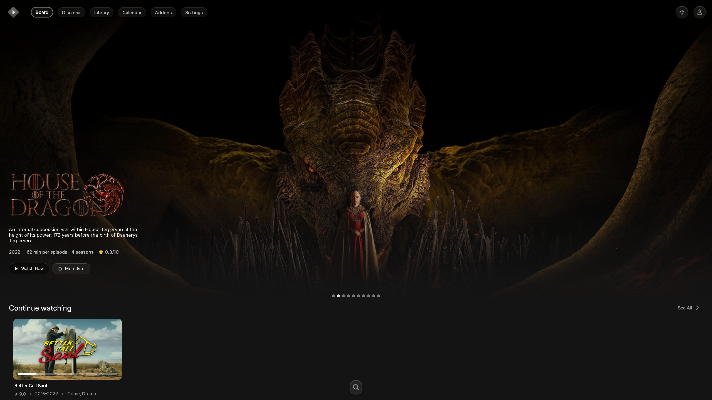
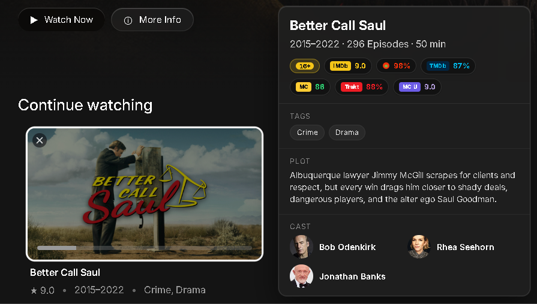
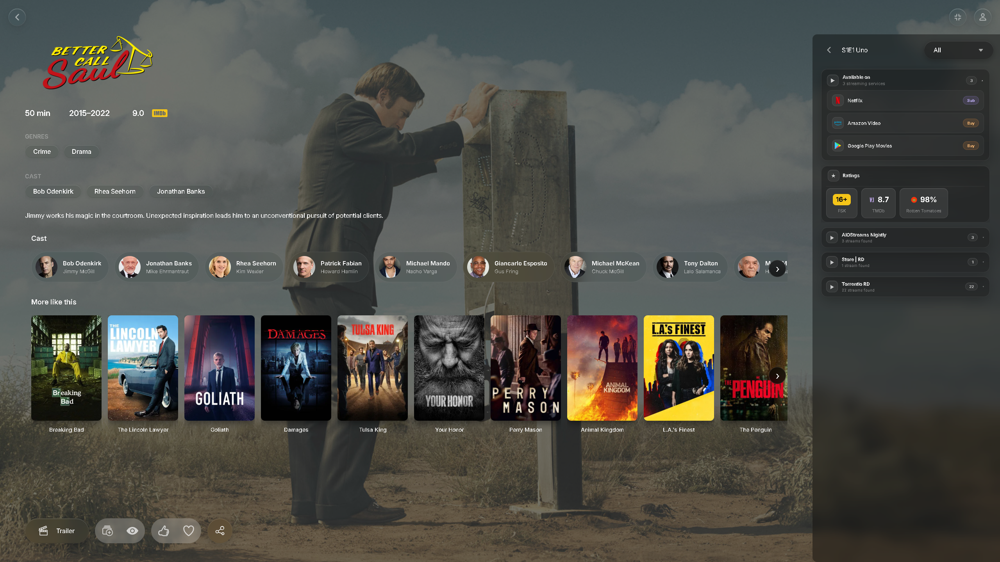

# MyStremio

**MyStremio** is a personalized Windows desktop client built on the Stremio shell stack.
It combines UI upgrades, player improvements, plugins/themes and library tools in one installer.

[](https://github.com/xAlphiiJr/MyStremio/releases/latest)
[](https://github.com/xAlphiiJr/MyStremio/releases)


> **Disclaimer:** MyStremio is an independent community project and is not affiliated with official Stremio.

---

## 📌 Table of Contents

- [📌 Table of Contents](#-table-of-contents)
- [❤️ Support](#-support)
- [🚀 Features](#-features)
  - [🪄 UI](#-ui)
  - [⚙️ Settings](#-settings)
  - [📺 Player](#-player)
  - [🎞️ Addon Manager](#-addon-manager)
- [🛠️ Patch Notes](#-patch-notes)
- [💾 Installation](#-installation)
  - [📂 Install paths](#-install-paths)
  - [📋 Requirements](#-requirements)
  - [🗑️ Uninstall](#️-uninstall)
  - [🧑‍💻 Build from source (developers)](#️-build-from-source-(developers))
- [🔒 Privacy and local data](#-privacy-and-local-data)
- [🙏 Credits](#-credits)
- [💬 Feedback](#-feedback)

---


### ❓ How MyStremio differs from official Stremio

-MyStremio uses MPV as the native video player

-Improved player tooling (hover timestamp, TheIntroDB/IntroDB with auto-skip options, controllable preload behavior, brightness control)

-Better stream organization and metadata presentation (enrichment panels and cleaner stream UI behavior)

-Integrated Cinebye addon manager (manage addons, disable Cinemeta)

-Custom library groups with JSON import/export

-Additional power-user options such as addon/plugin toggles and Discord Rich Presence

-Packaged as a ready-to-use single installer

---


### ❤️ Support

If you want to support my work you can leave a small tip on [ko-fi](https://ko-fi.com/xalphiijr), I would really appreciate it! <3 

---


## 🚀 Features


### 🪄 UI

MyStremio offers its own UI enhancements and combines it with already existing plugins made by the community.

#### 🏠 Board hero home view

The board includes a hero section with rotating titles. The Theme is made by [Fxy6969/Stremio-Glass-Theme](https://github.com/Fxy6969/Stremio-Glass-Theme) and just adapted for MyStremio.



#### 🖱️ Hover metadata in catalogs

   While browsing catalogs, hover cards show key information (ratings, plot, genres, cast) without forcing a page change.



#### 📖 Detail view with metadata and stream sidebar

The Data Enrichment Plugin by MrBlu03 (if a TMDB and MDBList API key is set under **Settings → MyStremio → API Keys**) offers an enhanced detail page with ratings, cast and similar titles.
The StreamUI plugin offers a clean and modern sidebar with folders to pick streams from. (The plugin works for the follwing addons: Most torrent addons, most usenet addons, [WatchHub](https://stremio-addons.net/addons/watchhub), [Ratings Aggregator](https://stremio-addons.net/addons/ratings-aggregator), [IMDb Ratings](https://stremio-addons.net/addons/imdb-ratings), [AfterCredits](https://aftercredits.almosteffective.com/configure.html)).



#### ▶️ Horizontal Navigation

  A new plugin that allows to scroll through catalogues right from the board without the need to click on "See All" and switch to the discovery page. Enabling this plugin might cause some performance issues depending on hardware and amount of catalogues. 

---


### ⚙️ Settings

MyStremio comes with a few custom settings including Favorite Languages, Plugins and Buffering.

#### ⚡ Quick Settings

At the top of the settings page you'll find the quick settings. Here you're able to hot swap between your favorite languages and enable autoskip for individual segment types. Quick Select reads your favorite languages and exposes them as one-click subtitle/audio buttons. How to define favorites is explained in the section below.

#### 🌐 Favorite subtitle and audio languages

Inside **player** settings, you can define favorite subtitle and audio languages that act as your preferred language pool.
This preference layer is used by the quick language actions shown in the previous section.

#### 🛠️ MyStremio

In the Stremio settings you will find the **MyStremio** section. These include settings for API Keys, plugins, buffering, library and discord.

- **API Keys** are managed centrally under Settings → MyStremio → API Keys (one key for all installed plugins that need it).
- **Plugins** can be managed directly from settings, including quick access to the plugins folder. There are MyStremio exclusive plugins and communtiy made plugins built into to installer. The following plugins from [REVENGE977's/stremio-enhanced](https://github.com/REVENGE977/stremio-enhanced) are tested and work with MyStremio: Enhanced Title Bar by Fxy, EnhancedCovers by Fxy, SlashtoSearch by REVENGE977. A few of other plugins are slightly tuned to fit into MyStremio including: Dynamic Hero by Fxy, Context Menu Fix by MrBlu03 and Data Enrichment by MrBlu03.
- **Preload** settings determine how much of the video gets buffered ahead. You can chose from buffering only the next 10 seconds or the entire video. This currently works for torrent/debrid streams and is not designed for usenet or http. That doesn't mean it won't work on those, I just can't test it as I'm not using usenet/http.
- **Library** json can be importet or exportet to keep your custom library entries safe or import them on another device. Updating the app won't remove your library entries, but if you decide to uninstall MyStremio and reinstall it in the future you will need the json to get your custom library back.
- **Discord** Rich Presence by [REVENGE977](https://github.com/REVENGE977/) enhances the native Discord integration and shows additional info.

---


### 📺 Player

MyStremio offers some quality of life changes available as plugins so you can enable/disable them to further customize your experience.

#### ⏱️ Skip Intro Plugin

Built in plugin that allows to receive and contribute segment timestamps to TheIntroDB and/or IntroDB while watching. Open the contribute panel from the player, mark times, pick the segment type, and submit — helps improve skip data for everyone. You have to set your personal API Key in the settings in order to use the submit feature! Since 2.3.3 AniSkip has been integrated into the Skip Intro Plugin!

#### ⏩ Seek Buttons Plugin

Built in plugin that adds configurable skip-back and skip-forward controls to the player bar — useful for quick rewinds or jumping ahead without scrubbing. The skip interval can be changed in the settings: MyStremio → Plugins → Player → Seek Buttons.

#### 🖼️ Picture Settings Plugin

Built in player plugin with Master Dim plus Contrast, Brightness, Gamma, and Saturation controls.

#### ⏳ Hover Timestamps Plugin

Built in plugin that adds timestamps when hovering the seek bar in the player.

#### 👤 Cast Overlay Plugin

Built in plugin that adds a cast section directly into the player.

#### 🎇 Anime4K Plugin

Built in shader plugin by [bloc97/Anime4K](https://github.com/bloc97/Anime4K) designed for anime. If enabled you can access the different shaders directly from the player. You can pick the shader quality in the plugin settings.

---


### 🎞️ Addon Manager

[Cinebye](https://cinebye.elfhosted.com/) is integrated so you can manage addons inside Stremio. MyStremio also adds **On/Off toggles** on the Addons page: Disabled addons stay installed but stop contributing catalogs/streams in this desktop client. This only works locally!

---


### 💡 Planned Features

- **PiP:** I'm working on a picture in picture video mode
- **Seek Bar Thumbnail:** I want to add a thumbnail when hovering over the seek bar in the player.

---


## 🛠️ Patch Notes


### 2.3.9
- **Addon Toggle** — Hardened addon toggles and fixed toggles getting overwritten by StreamUI
- **Cast Overlay** — Now displays episode specific cast members if available
- **Auto Skip** — Changed from instantly skipping segments to a 10 sec timer which can be canceled
- **Player Scroll Wheel** — Scrolling inside Cast no longer changes volume
- **Subtitles** — Fixed an issue where the custom subtitle settings won't get saved correctly for the next stream/episode

### 2.3.8

- **Download badges** — README shows GitHub release download counts
- **Picture Settings** — Master Dim / tone no longer dims subtitles
- **Skip Intro** — Skip button auto-hides after 10s with a countdown; after that it follows the control bar
- **Horizontal Navigation** — Board catalog chevrons/scroll moved to a toggleable plugin (default on); Continue Watching chevrons always stay
- **Addon Toggle** — Disable installed addons without uninstalling; they stay listed but contribute no catalogs/streams in MyStremio
- **Quick Settings** — Are now part of the settings menu bar


### 2.3.7

- **Board catalogue navigation** — Optimized catalogue loading on board to reduce lag on weaker hardware
- **Enhanced Title Bar** — Optimized enhanced title bar loading to reduce lag on weaker hardware
- **Search suggestions** — Optimized search suggestion order
- **Search results** — Fixed issue where search results would appear to big


### 2.3.6

- **WatchHub** — Redesigned “Available on” panel with provider logos, Sub/Buy/Rent/Free badges, and a cleaner tile grid (StreamUI)
- **Board catalog navigation** — Per-row chevrons, horizontal scroll, and LoadNextPage so board catalogs go beyond the first preview strip
- **Multi-source ratings** — Shared ratings on Detail (Data Enrichment) and Meta Hover (IMDb, TMDb, Metacritic, RT, Trakt, …) via shell proxy; optional MDBList key under Settings → API Keys unlocks the full set
- **Search suggestions** — Cinemeta type ahead above the search bar (posters, ranking, recent picks, keyboard navigation)
- **Stream flags** — Language codes in stream rows render as Twemoji flags (Liquid Glass no longer strips them)
- **Board hero** — Fixed the left grey gutter / full-bleed hero shading on the board
- **Continue Watching** — Enhanced Titlebar + Enhanced Covers stay in sync after card reuse; row chevrons re-center after landscape covers load

### 2.3.5


- **Cast Overlay** — Enabled by default on first install (still freely toggleable; updates never re-enable a plugin)
- **Next Episode** — No longer double-skips to the episode after next
- **Detail Slogan** — New plugin shows the TMDB tagline under the title/logo (based on allecsc's/Stremio-Kai; author credited in plugin metadata)
- **StreamUI** — Moved from Player to Interface plugins. Optional merge of Debrid Search / Intelligent Debrid Search / StremThru Store into one accordion
- **Data Enrichment** — Big update, now features Cast, Directors and Genres with pictures/symbols and disables native information so its not displayed twice
- **Player menus** — Now use the same background opacity.
- **Plugins** — Enable/disable in Settings applies live (no Ctrl+R) for all plugins now.

### 2.3.4

- **Nav menu icons** — Settings, Addons, and Help icons no longer disappear after opening the profile menu
- **Updater** — Update banner now says MyStremio instead of Stremio and sends requests less frequently
- **Anime4K** — Is now adjustable via button inside the player. Shader quality (S/M/L/VL/UL) selectable in plugin settings, default L
- **StreamUI** — Fixed performance issues caused by StreamUI plugin. Fixed an issue where it would place a second folder into the first one on usenet addons
- **Discord Rich Presence** — Fixed an issue where it would not display current page correctly
- **Library** — Harded library updating after title change
- **Plugin sync** — Fixed new bundled plugins (e.g. Picture Settings) not installing on upgrade; user-deleted plugins still stay removed
- **Continue Watching** — Posters refresh correctly after removing a title (Enhanced Covers / RPDB)
- **Board layout** — Fixed nav overlapping Continue Watching when Dynamic Hero is disabled

### 2.3.3

- **AniSkip** — Integrated to Intro Skip plugin
- **Anime4k** — Plugin added
- **shell/loading polish** — Plugin and Player loading,Transparency transitions and stream start more robust
- **Glass icon** — Replaced original Stremio logo with glass icon


### 2.3.2

- **Central API Keys** — Shared API keys (TMDB, RPDB, TheIntroDB, IntroDB, …) live under **Settings → MyStremio → API Keys**, discovered from installed plugin schemas; plugin cards show Set/Missing instead of duplicate inputs.
- **Player navigation fix** — Fixed the black screen after Episode → Next (Detail streams) → Back by syncing shell leave-cleanup with HashRouter `pushState`/`replaceState` and keeping the shell opaque until MPV actually presents frames.
- **Stream re-open fix** — Re-clicking the same stream after Back opens the player again normally (no history bounce away from a fresh stream click).


---


### Known Issues

- **Cast Search Addon:** The Cast Search Addon is not compatible with the StreamUI plugin as the cast members load the same way as video streams which messes with correct grouping.
- **Data Enrichment:** Shows Metadata from another title in the "Continue Watching" bar when switching back from episode detail page to series detail page.

---


## 💾 Installation

1. Download the latest installer from this repository's **[Releases](https://github.com/xAlphiiJr/MyStremio/releases/latest)** page.
2. Run `MyStremioSetup-v2.3.8_x64.exe` (or the latest version).
3. The installer sets up:
  - App binaries (`mystremio-shell.exe`, streaming server, FFmpeg, libmpv)
  - Bundled plugins and themes
  - Prebuilt local Web UI
  - WebView2 runtime (if missing)
  - Protocol handlers (`stremio://`, `magnet:`, optional `.torrent`)
4. Launch MyStremio from the Start menu or desktop shortcut.


### 📂 Install paths

- App: `%LOCALAPPDATA%\Programs\MyStremio\`
- User data (settings/addons): `%APPDATA%\MyStremio\`


### 📋 Requirements

- Windows 10/11 (64-bit)
- Internet connection (addons, metadata sources, streaming)
- Optional API keys for plugins (for example TMDB, TheIntroDB) under **Settings → MyStremio → API Keys**


### 🗑️ Uninstall

Use **Windows Apps & Features** or the Start menu uninstaller.
Optionally delete `%APPDATA%\MyStremio\` to remove all local user data.

### 🧑‍💻 Build from source (developers)

Requires Rust (MSVC), Visual Studio Build Tools, Inno Setup 6, Node.js with pnpm (optional, for Web UI rebuild), and an installed Stremio Desktop runtime (for `libmpv-2.dll`).

```powershell
cd stremio-shell\stremio-shell-ng-main
.\package-release.ps1
```

Output: `release\MyStremioSetup-v2.3.6_x64.exe`

The repo includes a prebuilt `stremio-shell/stremio-shell-ng-main/webui/` bundle. To rebuild the Web UI from source, clone [stremio-web](https://github.com/Stremio/stremio-web) into `.tmp/stremio-web`, apply MyStremio patches, then run the build script again.

---


## 🔒 Privacy and local data

- API keys, personal settings and library structure are stored locally in `%APPDATA%\MyStremio\`.
- Cinebye login uses your Stremio session at runtime.
- Discord Rich Presence only sends data when enabled and connected.

---


## 🙏 Credits

MyStremio includes parts of the following independent community projects:

- [REVENGE977/stremio-enhanced](https://github.com/REVENGE977/stremio-enhanced)
- [Fxy6969/Stremio-Glass-Theme](https://github.com/Fxy6969/Stremio-Glass-Theme)
- [Bo0ii/StreamGo](https://github.com/Bo0ii/StreamGo)
- [allecsc/Stremio-Kai](https://github.com/allecsc/Stremio-Kai)
- [bloc97/Anime4K](https://github.com/bloc97/Anime4K)
- [TheIntroDB](https://theintrodb.org/)
- [IntroDB](https://introdb.app/)

These are the projects I used as inspiration and some of their features for my own custom build. Definitely check out TheIntroDB and IntroDB, both of them deliver intro timestamps for us to enjoy for free.

---


## 💬 Feedback

This started as a fun personal project and is improved iteratively.
If you find reproducible bugs or have ideas, please share feedback or open an issue.
